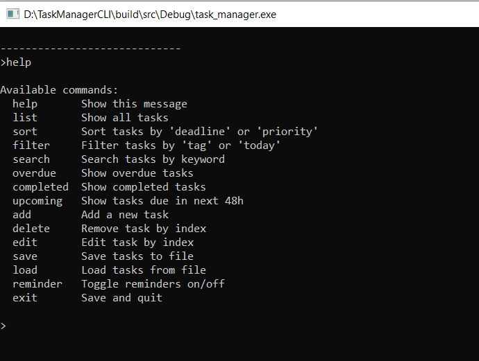
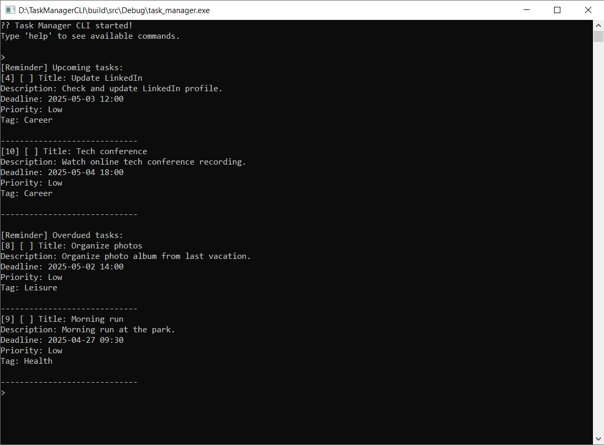

# 🗂️ Task Manager CLI

**Task Manager CLI** is a console-based task scheduling application with support for reminders, logging, hints, and autosaving.  
Built with C++ using a modular CMake project structure.

---

## 🚀 Features

- Add, edit, delete tasks
- Filter, sort, and search tasks
- Deadline reminders (within 48 hours)
- JSON-based task storage (automatically and manually saved/loaded)
- Asynchronous logging
- Idle-time hints (after 2 minutes)

---

## 📦 Build Instructions

Clone the repository and build using CMake:

```bash
git clone https://github.com/your-username/task-manager-cli.git
cd task-manager-cli
mkdir build && cd build
cmake ..
cmake --build .
```

---

### ▶️ Run

After building, you can run the executable:

```bash
./task_manager.exe
```

---

## 🛠️ Dependencies

- C++17 or later  
- [nlohmann/json](https://github.com/nlohmann/json) (included) — header-only JSON library used for task serialization

---

## 📂 Project Structure

```
.
├── src/app/             # Main app logic (App.cpp, App.h)
├── src/cli/             # Command parsing and UI
├── src/core/            # Task and TaskManager logic
├── src/io/              # File and JSON storage
├── src/utils/           # Utility modules (e.g., DateTimeUtils)
├── src/services/        # Async services (Logger, Reminder, Hint, AutoSave)
├── docs/screenshots/    # Screenshots for documentation
├── external/nlohmann/   # Header-only JSON library (https://github.com/nlohmann/json)
├── build/               # (Ignored) Build artifacts
├── CMakeLists.txt       # Main build script
└── README.md
```

---

## 📸 Screenshots

Screenshots demonstrating key commands and outputs:

### Task Manager functional


- Task list
- Filtering by tag or deadline (e.g., today, overdue, upcoming)
- Idle hint popup
- Reminder alerts


📁 Located in: `docs/screenshots/`

---

## 📌 Notes

This project was developed to practice clean architecture, modular CMake organization, and asynchronous service handling in C++.

---

## 📝 License

This project is licensed under the **MIT License**.  
See the [LICENSE](LICENSE) file for details.

---

## 👨‍💻 Author

Developed by [denyskovalMSW](https://github.com/denyskovalMSW)